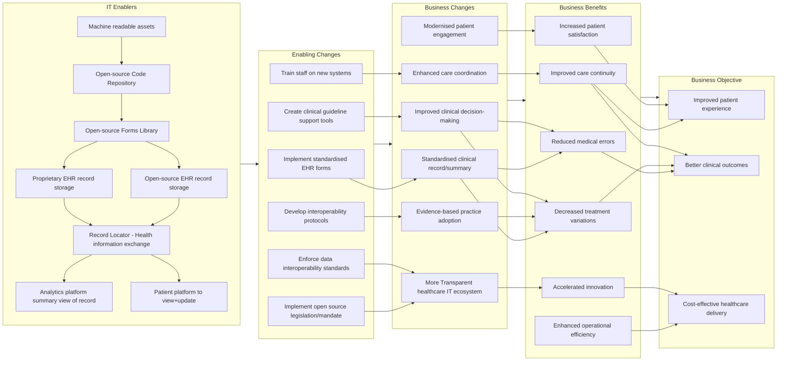
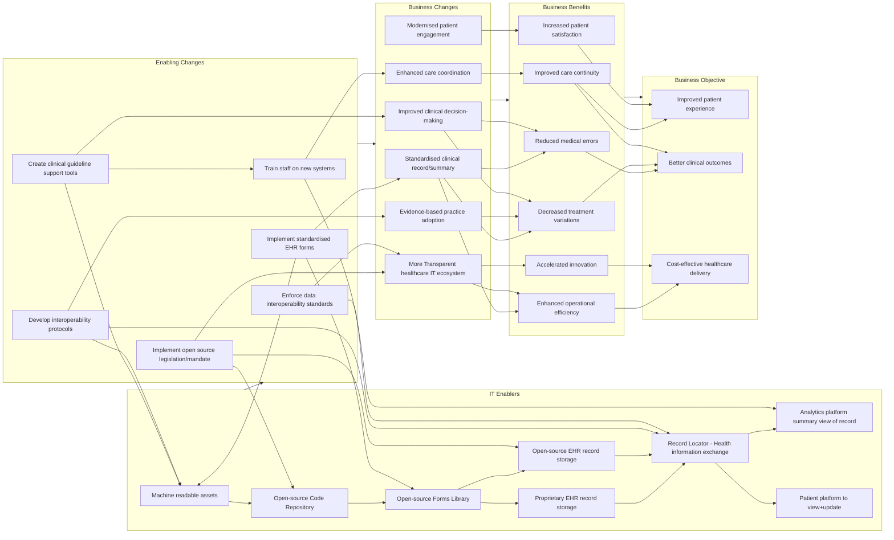

# cleaner version

```mermaid
graph LR
                   %% Connections between categories
                IT_Enablers --> Enabling_Changes --> Business_Changes --> Business_Benefits --> Business_Objective

                subgraph IT_Enablers[IT Enablers]
                direction TB
                    E00[Machine readable assets]
                    E0[Open-source Code Repository]
                    E1[Open-source Forms Library]
                    E2[Proprietary EHR record storage]
                    E3[Open-source EHR record storage]
                    E4[Record Locator - Health information exchange]
                    E5[Analytics platform summary view of record]
                    E6[Patient platform to view+update]
                
                 E00-->E0
                 E0-->E1
                 E1-->E2
                 E1-->E3
                 E2-->E4
                 E3-->E4
                 E4-->E5
                 E4-->E6
               %% E2-->|copy|E3

                end

                subgraph Enabling_Changes[Enabling Changes]
                    direction TB
                    
                    D1[Implement standardised EHR forms]
                    D2[Develop interoperability protocols]
                    D4[Train staff on new systems]
                    D5[Create clinical guideline support tools]
                    D6[Implement open source legislation/mandate]
                    D7[Enforce data interoperability standards]
    
                   

                end

                subgraph Business_Changes[Business Changes]
                    C1[Standardised clinical record/summary]
                    C2[Evidence-based practice adoption]
                    C3[Enhanced care coordination]
                    C4[Improved clinical decision-making]
                    C5[Modernised patient engagement]
                    C7[More Transparent healthcare IT ecosystem]
                
                end

                subgraph Business_Benefits[Business Benefits]
                    B1[Reduced medical errors]
                    B2[Decreased treatment variations]
                    B3[Improved care continuity]
                    B4[Enhanced operational efficiency]
                    B5[Increased patient satisfaction]
                    B6[Accelerated innovation]
                end

                subgraph Business_Objective[Business Objective]
                    A1[Improved patient experience]
                    A2[Better clinical outcomes]
                    A3[Cost-effective healthcare delivery]
                end

              

                %% Enabling Changes to Business Changes
                D1 --> C1
                D2 --> C2
                D4 --> C3
                D5 --> C4
                D6 --> C7
                D7 --> C7
                %%D8 --> C7
                %%D9 --> C3

                %% Business Changes to Business Benefits
                C1 --> B1
                C1 --> B2
                C2 --> B2
                C3 --> B3
                C4 --> B1
                C4 --> B2
                C5 --> B5
                C7 --> B6

                %% Business Benefits to Business Objective
                B1 --> A2
                B2 --> A2
                B3 --> A1
                B3 --> A2
                B4 --> A3
                B5 --> A1
                B6 --> A3


```

# version with more relationship

```mermaid
graph LR
                   %% Connections between categories
                IT_Enablers --> Enabling_Changes --> Business_Changes --> Business_Benefits --> Business_Objective

                subgraph IT_Enablers[IT Enablers]
                direction TB
                    E00[Machine readable assets]
                    E0[Open-source Code Repository]
                    E1[Open-source Forms Library]
                    E2[Proprietary EHR record storage]
                    E3[Open-source EHR record storage]
                    E4[Record Locator - Health information exchange]
                    E5[Analytics platform summary view of record]
                    E6[Patient platform to view+update]
                
                 E00-->E0
                 E0-->E1
                 E1-->E2
                 E1-->E3
                 E2-->E4
                 E3-->E4
                 E4-->E5
                 E4-->E6
               %% E2-->|copy|E3

                end

                subgraph Enabling_Changes[Enabling Changes]
                    direction TB
                    
                    D1[Implement standardised EHR forms]
                    D2[Develop interoperability protocols]
                    D4[Train staff on new systems]
                    D5[Create clinical guideline support tools]
                    D6[Implement open source legislation/mandate]
                    D7[Enforce data interoperability standards]
    
                   

                end

                subgraph Business_Changes[Business Changes]
                    C1[Standardised clinical record/summary]
                    C2[Evidence-based practice adoption]
                    C3[Enhanced care coordination]
                    C4[Improved clinical decision-making]
                    C5[Modernised patient engagement]
                    C7[More Transparent healthcare IT ecosystem]
                
                end

                subgraph Business_Benefits[Business Benefits]
                    B1[Reduced medical errors]
                    B2[Decreased treatment variations]
                    B3[Improved care continuity]
                    B4[Enhanced operational efficiency]
                    B5[Increased patient satisfaction]
                    B6[Accelerated innovation]
                end

                subgraph Business_Objective[Business Objective]
                    A1[Improved patient experience]
                    A2[Better clinical outcomes]
                    A3[Cost-effective healthcare delivery]
                end

                %% Connections from Enabling Changes (including legislative changes)
              D1-->E1
              D2-->E4
               D4-->E5
               D5-->E00
              D6-->E0
              D6-->E3
              D7-->E4
              D1-->E00
              D2-->E00
               D5-->D4

              C1-->B4
              C7-->B4
             

                %% Enabling Changes to Business Changes
                D1 --> C1
                D2 --> C2
                D4 --> C3
                D5 --> C4
                D6 --> C7
                D7 --> C7
                %%D8 --> C7
                %%D9 --> C3

                %% Business Changes to Business Benefits
                C1 --> B1
                C1 --> B2
                C2 --> B2
                C3 --> B3
                C4 --> B1
                C4 --> B2
                C5 --> B5
                C7 --> B6

                %% Business Benefits to Business Objective
                B1 --> A2
                B2 --> A2
                B3 --> A1
                B3 --> A2
                B4 --> A3
                B5 --> A1
                B6 --> A3

```        
