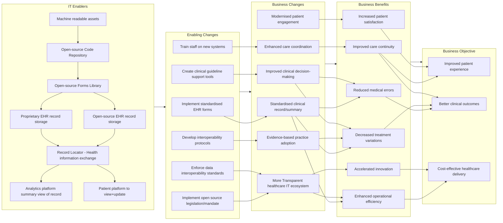
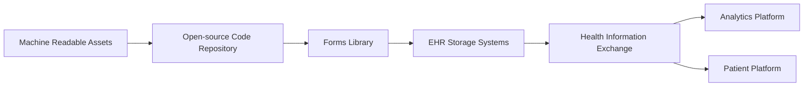
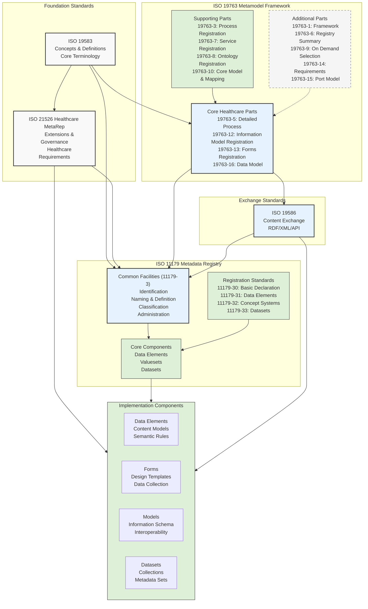
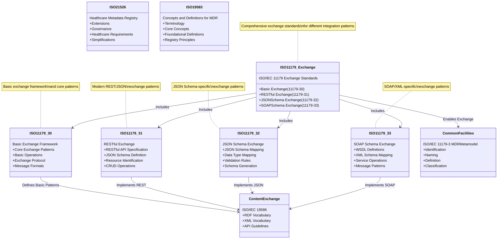

# Clinical Data Standards Team Overview

## Mission
The Clinical Data Standards team develops and maintains the foundational data infrastructure that enables effective healthcare delivery at the point of care while supporting downstream data utilisation. We focus on creating and implementing standards that support clinical documentation, data exchange, and interoperability across healthcare systems.

## Core Responsibilities

### Standards Development and Implementation
- OpenEHR archetypes and templates aligned with ISO 11179 principles
- Healthcare metadata registry standards (ISO 21526 MetaRep)
- FHIR questionnaire resources and form standardisation
- Integration protocols for clinical data exchange
- Metadata repository governance and maintenance

### Data Architecture
- Master data management for clinical entities
- Healthcare-specific data dictionary development
- Metadata registry design and implementation
- Standardised clinical documentation frameworks
- Interoperability protocol development

### Clinical Support
- Standardised EHR forms implementation
- Clinical guideline support tools
- Evidence-based practice frameworks
- Care coordination enablement
- Patient engagement platforms

## Team Structure and Operations

### Functional Areas
1. **Standards Development**
   - Clinical information modeling
   - Metadata framework design
   - Interoperability protocol creation

2. **Implementation Support**
   - Technical guidance
   - System integration
   - Standards compliance verification

3. **Clinical Liaison**
   - Healthcare provider engagement
   - Requirements gathering
   - Clinical workflow optimisation

### Key Deliverables
- Standardised clinical documentation templates
- Metadata registry frameworks
- Interoperability specifications
- Implementation guides
- Clinical decision support tools

## Impact Areas

### Direct Clinical Care
- Standardised clinical documentation
- Improved clinical decision-making
- Enhanced care coordination
- Modernised patient engagement

### System Benefits
- Reduced medical errors
- Decreased treatment variations
- Improved care continuity
- Enhanced operational efficiency
- Accelerated healthcare innovation

### Strategic Outcomes
- Improved patient experience
- Better clinical outcomes
- Cost-effective healthcare delivery
- Transparent healthcare IT ecosystem

## Stakeholder Engagement

### Primary Stakeholders
- Clinical care providers
- Healthcare IT teams
- Standards organisations
- Healthcare administrators
- Patient advocacy groups

### Collaboration Patterns
- Regular clinical workflow assessments
- Standards development workshops
- Implementation support sessions
- Cross-functional team coordination
- Continuous feedback integration

## Current Initiatives

### Technical Infrastructure
- Open-source code repository development
- Forms library standardisation
- Health information exchange enablement
- Analytics platform implementation
- Patient access platform development

### Process Implementation
- Standardised EHR form adoption
- Interoperability protocol deployment
- Clinical guideline tool integration
- Staff training programs
- Data governance framework establishment

## Success Metrics
- Clinical documentation efficiency
- Care coordination effectiveness
- Patient satisfaction levels
- System interoperability rates
- Innovation adoption metrics

# Clinical Data Standards Technical Implementation Guide

## Standards Framework Architecture

### Foundation Layer
- **ISO 19583**: Core concepts, terminology, and foundational definitions
- **ISO 21526 (MetaRep)**: Healthcare-specific extensions and governance requirements
- **Key Applications**: Terminology standardisation, semantic foundations, governance frameworks

### Exchange Layer
- **ISO 19586**: Content exchange specifications
  - RDF/XML implementations
  - API standardisation
  - Exchange protocols

### Metadata Framework (ISO 19763)
#### Core Components
- Process registration (19763-5)
- Information model registration (19763-12)
- Forms registration (19763-13)
- Data model specifications (19763-16)

#### Supporting Elements
- Process and service registration
- Ontology management
- Core model mapping
- Registry frameworks

### Metadata Registry Implementation (ISO 11179)
#### Core Facilities
- Identification protocols
- Naming conventions
- Definition standards
- Classification systems
- Administrative frameworks

#### Implementation Components
1. **Data Elements**
   - Content models
   - Semantic rules
   - Validation frameworks

2. **Forms Management**
   - Design templates
   - Data collection standards
   - Validation rules

3. **Information Models**
   - Schema definitions
   - Interoperability patterns
   - Integration protocols

4. **Dataset Standards**
   - Collection frameworks
   - Metadata specifications
   - Quality assurance

## Technical Implementation Guidelines

### Standards Integration
1. **Foundation Layer Integration**
   - Implement ISO 19583 terminology standards
   - Apply MetaRep governance frameworks
   - Establish semantic foundations

2. **Exchange Layer Implementation**
   - Deploy content exchange protocols
   - Implement API standards
   - Configure exchange frameworks

3. **Metadata Framework Deployment**
   - Configure registration systems
   - Implement model mappings
   - Deploy ontology management

### System Components

#### Core Infrastructure

#### Implementation Flow
1. **Asset Development**
   - Machine-readable format creation
   - Code repository setup
   - Forms library development

2. **Storage Implementation**
   - EHR system integration
   - Data exchange configuration
   - Interface standardisation

3. **Platform Deployment**
   - Analytics system setup
   - Patient portal implementation
   - Access control configuration

### Exchange Standards Implementation

#### Basic Exchange Framework (11179-30)
- Core patterns implementation
- Basic operations setup
- Protocol configuration
- Message format standardisation

#### Modern Exchange Standards
1. **RESTful Implementation (11179-31)**
   - API specifications
   - JSON schema deployment
   - Resource identification
   - CRUD operations

2. **Schema Standards (11179-32/33)**
   - JSON/XML mapping
   - Validation rules
   - Schema generation
   - Service operations

## Compliance and Governance

### Standards Compliance
- Regular audits
- Validation frameworks
- Conformance testing
- Documentation requirements

### Governance Framework
1. **Policy Management**
   - Standard operating procedures
   - Change management
   - Version control
   - Review processes

2. **Quality Assurance**
   - Testing protocols
   - Validation procedures
   - Performance monitoring
   - Error handling

### Security Implementation
- Access control
- Data protection
- Audit logging
- Compliance monitoring

# Healthcare Metadata Registry Standards Framework 

 
 
 

# Healthcare Metadata Registry Standards Framework

| Standard | Title | Description | Key Purpose |
|----------|-------|-------------|-------------|
| ISO 21526:2019 | Healthcare Metadata Registry Framework (MetaRep) | Extensions and clarifications of ISO/IEC 11179 for healthcare | Provides healthcare-specific implementation guidance and governance for metadata registries |
| ISO/IEC 11179-3 | Metadata Registry Metamodel (MDRMetamodel) | Common facilities for metadata registry content | Defines core structures for identification, naming, definition, and administration |
| ISO/IEC 11179-7 | Metadata Registry Dataset Registration (MDRDatasets) | Registration of metadata about datasets | Specifies how to register and manage dataset metadata |
| ISO/IEC 11179-31 | Data Exchange for MDR Metamodel | Modern REST/JSON-based exchange patterns | Defines web-friendly API specifications and JSON schemas for metadata exchange |
| ISO/IEC 19583 | Concepts and Definitions for Metadata Registries | Foundational concepts and terminology | Establishes core principles and semantic foundations for all metadata registry standards |
| ISO/IEC 19586 | Content Exchange | RDF and XML vocabularies for metadata exchange | Provides standardised exchange formats and implementation guidelines |
| ISO/IEC 19763-10 | MTF - Metamodel for Framework Interoperability | Core framework for integrating different metadata frameworks | Enables harmonisation and mapping between different metadata frameworks |
| ISO/IEC 19763-12 | MFI Information Model Registration | Information model metadata registration | Specifies how to register and manage information model metadata |
| ISO/IEC 19763-13 | MFI Forms Registration | Form design metadata registration | Defines registration and management of form metadata |
| ISO/IEC 19763-3 | MFI Process Registration | Process model metadata registration | Specifies registration of process-related metadata |
| ISO/IEC 19763-7 | MFI Service Registration | Service metadata registration | Defines registration of service-related metadata |
| ISO/IEC 19763-8 | MFI Ontology Registration | Ontology metadata registration | Specifies registration of ontology-related metadata |

## Key Relationships:
1. **Foundation Layer**
   - ISO/IEC 19583 provides the conceptual foundation
   - ISO/IEC 11179-3 provides the core metadata registry framework

2. **Healthcare Implementation**
   - ISO 21526 extends and governs the framework for healthcare
   - Provides simplifications and extensions for healthcare use cases

3. **Exchange Standards**
   - ISO/IEC 19586 defines traditional exchange formats
   - ISO/IEC 11179-31 provides modern web-based exchange patterns

4. **Specialised Registration**
   - ISO/IEC 19763 series provides specific registration frameworks
   - ISO/IEC 11179-7 handles dataset registration

## Primary Uses:
- Healthcare data standardisation
- Clinical research data management
- Healthcare system interoperability
- Metadata registry implementation
- Healthcare data governance

ISO 19763-10 (MTF) plays a crucial role by:
1. Providing core definitions for framework interoperability
2. Enabling integration between different metadata frameworks
3. Supporting metamodel harmonisation
4. Facilitating cross-framework mapping
5. Defining interoperability patterns between different metadata standards

# Deeper look into the exchange

| Standard | Title | Description | Key Purpose |
|----------|-------|-------------|-------------|
| ISO/IEC 11179-30 | Basic Exchange Framework | Core exchange patterns and operations | Provides foundational exchange patterns and protocols for metadata registries |
| ISO/IEC 11179-31 | RESTful Exchange | REST-based API patterns | Defines modern web API patterns for metadata exchange |
| ISO/IEC 11179-32 | JSON Schema Exchange | JSON Schema implementation | Specifies JSON Schema mapping and validation for metadata exchange |
| ISO/IEC 11179-33 | SOAP Schema Exchange | SOAP/XML implementation | Defines SOAP-based web service patterns for metadata exchange |

Key Relationships and Features:

1. **ISO/IEC 11179-30 (Basic Exchange)**
   - Defines core exchange patterns
   - Establishes basic operations
   - Specifies protocol requirements
   - Provides message format foundations

2. **ISO/IEC 11179-31 (RESTful Exchange)**
   - Modern REST API patterns
   - Resource-oriented architecture
   - JSON-based data exchange
   - CRUD operation specifications

3. **ISO/IEC 11179-32 (JSON Schema)**
   - JSON Schema mappings
   - Data type specifications
   - Validation rules
   - Schema generation patterns

4. **ISO/IEC 11179-33 (SOAP Schema)**
   - WSDL definitions
   - XML Schema mappings
   - Service operation patterns
   - Message exchange patterns

These exchange standards collectively provide:
- Multiple integration patterns
- Technology-specific implementations
- Consistent exchange protocols
- Interoperable metadata sharing

# Implementation Success and Enablement Guide

## Change Management Strategy

### Technical Enablers to Changes
1. **Foundation Development**
   - Machine-readable asset creation
   - Open-source repository establishment 
   - Forms library standardisation
   - EHR storage solutions
   - Health information exchange
   - Analytics/patient platforms

2. **Change Implementation**
   - Standardised EHR forms
   - Interoperability protocols
   - Staff training programs
   - Clinical guideline tools
   - Open source mandates
   - Data standards enforcement

### Business Impact Chain

#### Direct Changes
- Standardised clinical records
- Evidence-based practice adoption
- Enhanced care coordination
- Improved clinical decisions
- Modern patient engagement
- Transparent healthcare IT

#### Business Benefits
- Reduced errors
- Decreased treatment variations
- Improved care continuity
- Enhanced efficiency
- Increased patient satisfaction
- Accelerated innovation

#### Strategic Objectives
- Improved patient experience
- Better clinical outcomes
- Cost-effective delivery

## Implementation Framework

### Technical Readiness
1. **Infrastructure Assessment**
   - System capabilities
   - Integration points
   - Data flow mapping
   - Security requirements

2. **Standards Alignment**
   - ISO compliance review
   - Metadata registry setup
   - Exchange protocol verification
   - Form standardisation

### Organisational Readiness
1. **Stakeholder Engagement**
   - Clinical leadership buy-in
   - IT team preparation
   - Staff training plans
   - Change communication

2. **Process Integration**
   - Workflow adaptation
   - Documentation updates
   - Quality monitoring
   - Feedback mechanisms

## Success Metrics Framework

### Implementation Metrics
1. **Technical Success**
   - Standards compliance rate
   - System integration completeness
   - Data quality scores
   - Exchange success rates

2. **Operational Success**
   - Form adoption rates
   - Staff proficiency levels
   - Process efficiency gains
   - Error reduction rates

### Outcome Metrics
1. **Clinical Impact**
   - Care quality indicators
   - Decision support utilisation
   - Documentation completeness
   - Care coordination effectiveness

2. **Business Value**
   - Operational efficiency gains
   - Cost reduction metrics
   - Innovation adoption rates
   - Patient satisfaction scores

# Clinical Data Standards: Practical Implementation Reality

## Current Environment Context

### Governance Challenges
- Product-driven environment with limited cross-program coordination
- Gaps between strategic vision and implementation capability
- Unclear decision-making authorities for technical strategy
- Resource constraints affecting strategic planning

### Practical Navigation Strategies
1. **Cross-Program Alignment**
   - Early engagement with related product teams
   - Document shared dependencies and requirements
   - Build informal consensus before formal submissions
   - Maintain flexibility in technical approaches

2. **Resource Management**
   - Focus on core capabilities first
   - Build modular solutions that can evolve
   - Document technical debt and future needs
   - Plan for incremental improvements

## Implementation Approach

### Short-Term Success
1. **Project Planning**
   - Clear scope definition
   - Documented technical decisions
   - Identified dependencies
   - Flexible implementation paths

2. **Stakeholder Management**
   - Early engagement with TRG
   - Regular product owner coordination
   - Clear documentation of decisions
   - Transparent communication about limitations

### Long-Term Considerations
1. **Strategic Alignment**
   - Document strategic intent
   - Plan for future integration
   - Build extensible solutions
   - Consider broader ecosystem needs

2. **Risk Mitigation**
   - Technical debt tracking
   - Alternative path planning
   - Regular architecture reviews
   - Documented assumptions

## Working Within Constraints

### Practical Guidelines
1. **Documentation**
   - Clear rationale for decisions
   - Impact on other systems
   - Future integration possibilities
   - Resource requirements

2. **Implementation**
   - Modular architecture
   - Standard interfaces
   - Minimal technical debt
   - Clear upgrade paths

### Recommendations
1. **Project Setup**
   - Early stakeholder identification
   - Clear governance documentation
   - Regular cross-team coordination
   - Flexible technical approaches

2. **Delivery Strategy**
   - Incremental implementation
   - Regular progress review
   - Clear communication
   - Documented decisions
