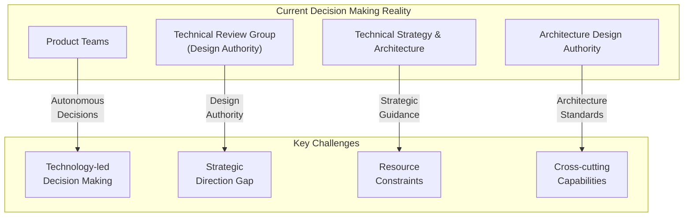
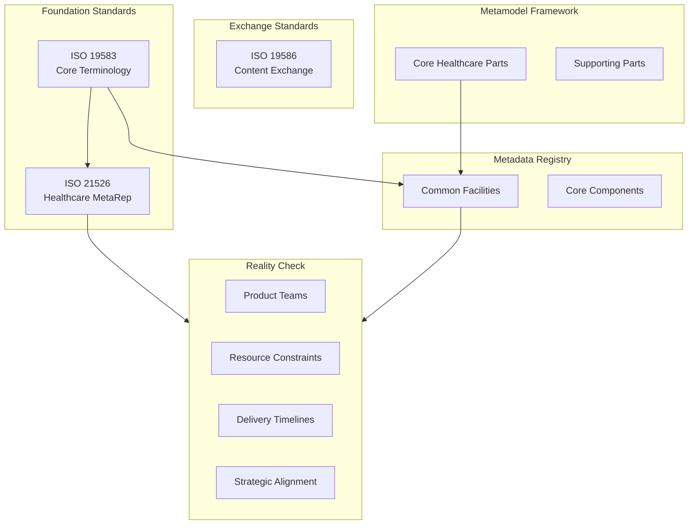
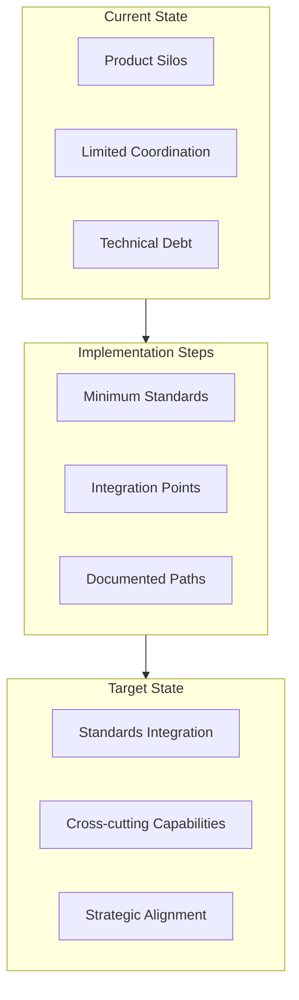

# Clinical Data Standards: Working in the Real World

## Understanding the Current Environment

### Organizational Context
- Product-led environment with autonomous teams
- Distributed decision-making across multiple governance bodies
- Resource constraints affecting strategic planning
- Gap between strategic vision and implementation capability

### Governance Landscape


## Navigating the Environment

### Current Realities
1. **Decision Making Process**
   - Multiple governance bodies with overlapping responsibilities
   - Unclear paths for strategic technical decisions
   - Product teams often driving technical strategy
   - Limited cross-program coordination

2. **Resource Constraints**
   - Gap between strategic ambition and capability
   - Limited architectural resources
   - Technical debt accumulation
   - Short-term funding cycles

### Working Effectively
1. **Building Consensus**
   - Early stakeholder engagement
   - Cross-product collaboration
   - Documented decision rationale
   - Clear communication paths

2. **Managing Constraints**
   - Modular implementation approach
   - Flexible technical architecture
   - Documented technical debt
   - Progressive enhancement strategy

## Value Chain Implementation

```mermaid
graph LR
    IT_Enablers --> Enabling_Changes --> Business_Changes --> Business_Benefits --> Business_Objective
    
    subgraph IT_Enablers[IT Enablers]
        direction TB
        E00[Machine readable assets]
        E0[Open-source Code Repository]
        E1[Open-source Forms Library]
        E2[Proprietary EHR storage]
        E3[Open-source EHR storage]
        E4[Record Locator - HIE]
        E5[Analytics platform]
        E6[Patient platform]
    end

    subgraph Enabling_Changes[Enabling Changes]
        D1[Standardised EHR forms]
        D2[Interoperability protocols]
        D4[Staff training]
        D5[Clinical guideline tools]
        D6[Open source mandate]
        D7[Data standards]
    end

    subgraph Business_Changes[Business Changes]
        C1[Standardised records]
        C2[Evidence-based practice]
        C4[Clinical decision-making]
        C5[Patient engagement]
        C7[Transparent IT ecosystem]
    end
```


## Practical Implementation Approaches

### Short-term Strategy
1. **Project Planning**
   - Clear scope definition
   - Documented dependencies
   - Flexible implementation paths
   - Regular stakeholder alignment

2. **Technical Implementation**
   - Modular architecture
   - Standard interfaces
   - Minimal technical debt
   - Clear upgrade paths

### Long-term Considerations
1. **Strategic Alignment**
   - Document strategic intent
   - Plan for future integration
   - Build extensible solutions
   - Consider ecosystem needs

2. **Risk Mitigation**
   - Technical debt tracking
   - Alternative path planning
   - Regular architecture reviews
   - Documented assumptions

## Standards Framework in Context


# Clinical Data Standards: Practical Implementation Strategies

## Navigating Product-Team Dynamics

### Building Cross-Product Alignment
1. **Early Engagement Strategy**
   - Map dependencies across product teams
   - Identify shared technical requirements
   - Document common pain points
   - Create shared success metrics

2. **Technical Debt Management**
   ```mermaid
   graph TB
       subgraph Planning["Planning Phase"]
           ID["Identify Debt"] --> AS["Assess Impact"]
           AS --> PR["Prioritize"]
           PR --> PL["Plan Remediation"]
       end

       subgraph Implementation["Implementation"]
           DM["Document Minimum<br/>Viable Solution"] --> FP["Future-Proof<br/>Design"]
           FP --> IP["Incremental<br/>Path"]
       end

       Planning --> Implementation
       Implementation --> |"Feedback"| Planning
   ```

### Resource Optimization
1. **Working with Constraints**
   - Focus on core capabilities
   - Document "nice-to-have" features
   - Create modular components
   - Plan incremental improvements

2. **Stakeholder Management**
   - Clear communication of limitations
   - Regular progress updates
   - Documented decision rationale
   - Transparent prioritization

## Standards Implementation Reality

### Practical Framework Adoption


### Progressive Enhancement Strategy
1. **Base Implementation**
   - Core standards adoption
   - Essential interoperability
   - Basic data exchange
   - Fundamental metadata

2. **Enhancement Phases**
   - Advanced features
   - Extended integration
   - Improved capabilities
   - Optimization opportunities

## Working with Governance

### Navigation Strategy
1. **Design Authority Engagement**
   - Early TRG consultation
   - Clear problem statements
   - Evidence-based proposals
   - Alternative solutions

2. **Documentation Requirements**
   - Decision records
   - Technical rationale
   - Impact assessment
   - Future considerations

### Cross-Team Coordination

```mermaid
graph LR
    subgraph Coordination["Coordination Framework"]
        direction TB
        PO["Product Owners"]
        SA["Solution Architects"]
        BA["Business Analysts"]
        TA["Technical Architects"]
    end

    subgraph Alignment["Alignment Points"]
        direction TB
        SR["Standards Requirements"]
        TR["Technical Requirements"]
        BR["Business Requirements"]
        IR["Integration Requirements"]
    end

    Coordination --> Alignment
    Alignment --> Implementation

    subgraph Implementation["Implementation Reality"]
        direction TB
        CT["Current Technical State"]
        FR["Future Requirements"]
        RC["Resource Constraints"]
        TD["Technical Debt"]
    end
```


## Practical Delivery Framework

### Implementation Phases
1. **Phase 1: Foundation**
   - Basic standards compliance
   - Essential integrations
   - Core functionality
   - Minimum viable product

2. **Phase 2: Enhancement**
   - Extended standards
   - Advanced features
   - Optimization
   - Technical debt reduction

3. **Phase 3: Optimization**
   - Full standards adoption
   - Complete integration
   - Performance tuning
   - Future-proofing

### Risk Management
1. **Technical Risks**
   - Standards compliance gaps
   - Integration challenges
   - Performance issues
   - Scalability concerns

2. **Organizational Risks**
   - Resource constraints
   - Priority conflicts
   - Stakeholder alignment
   - Governance challenges

## Success Metrics and Monitoring

### Key Performance Indicators
1. **Technical Success**
   - Standards compliance rate
   - Integration completeness
   - System performance
   - Technical debt reduction

2. **Business Success**
   - User adoption
   - Process efficiency
   - Cost effectiveness
   - Strategic alignment

Would you like me to expand on any of these sections or add more specific implementation details?